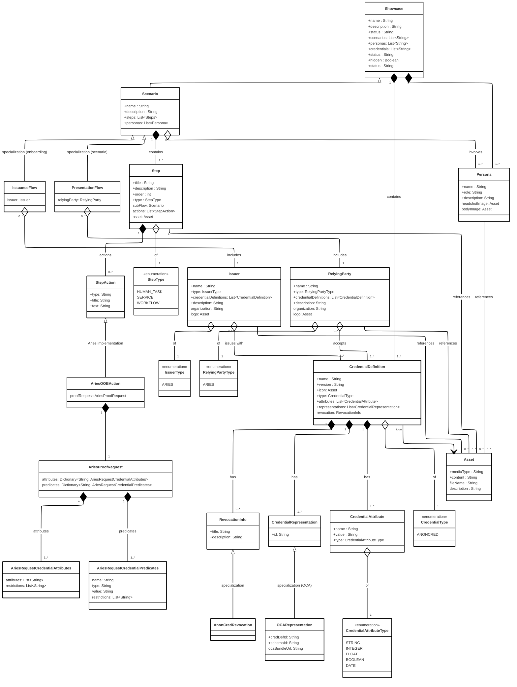

```mermaid
---
config:
  theme: neo
  layout: elk
---
classDiagram
    class Showcase {
        +name : String
        +description : String
        +status : String
        +scenarios: List~String~
        +personas: List~String~
        +credentials: List~String~
        +status : String
        +hidden : Boolean
        +status : String
    }
    class Scenario {
        <!-- Scenario is a collection of workflows -->
        +name : String
        +description : String
        +steps: List~Steps~
        +personas: List~Persona~
    }
    class IssuanceFlow {
        issuer: Issuer
    }
    class PresentationFlow {
        relyingParty: RelyingParty
    }
    class Step {
        +title : String
        +description : String
        +order : int
        +type : StepType
        subFlow: Scenario
        actions: List~StepAction~
        asset: Asset
    }
    class StepAction {
        +type: String
        +title: String
        +text: String
    }
    class AriesOOBAction {
        proofRequest: AriesProofRequest
    }
    class AriesProofRequest {
        attributes: Dictionary~String, AriesRequestCredentialAttributes~
        predicates: Dictionary~String, AriesRequestCredentialPredicates~
    }
    class AriesRequestCredentialAttributes {
        attributes: List~String~
        restrictions: List~String~
    }
    class AriesRequestCredentialPredicates {
        name: String
        type: String
        value: String
        restrictions: List~String~
    }
    class StepType {
        <<enumeration>>
        HUMAN_TASK
        SERVICE
        WORKFLOW
    }
    class Asset {
        +mediaType : String
        +content : String
        fileName : String
        description : String
    }
    class Persona {
        +name : String
        +role: String
        +description: String
        headshotImage: Asset
        bodyImage: Asset
    }
    class Issuer {
        +name : String
        +type: IssuerType
        +credentialDefinitions: List~CredentialDefinition~
        +description: String
        organization: String
        logo: Asset
    }
    class IssuerType {
        <<enumeration>>
        ARIES
    }
    class RelyingParty {
        +name : String
        +type: RelyingPartyType
        +credentialDefinitions: List~CredentialDefinition~
        +description: String
        organization: String
        logo: Asset
    }
    class RelyingPartyType {
        <<enumeration>>
        ARIES
    }
    class CredentialDefinition {
        +name : String
        +version : String
        +icon: Asset
        +type: CredentialType
        +attributes: List~CredentialAttribute~
        +representations: List~CredentialRepresentation~
        revocation: RevocationInfo
   }
   class RevocationInfo {
        +title: String
        +description: String
   }
   class AnonCredRevocation {
   }
   class CredentialRepresentation {
        +id: String
   }
   class OCARepresentation {
       +credDefId: String
       +schemaId: String
       ocaBundleUrl: String
   }
    class CredentialAttribute {
        +name : String
        +value : String
        +type: CredentialAttributeType
    }
    class CredentialType {
        <<enumeration>>
        ANONCRED
    }
   class CredentialAttributeType {
    <<enumeration>>
    STRING
    INTEGER
    FLOAT
    BOOLEAN
    DATE
   }
    Showcase <|-- Scenario
    Showcase "1" *-- "1..*" Persona
    Showcase "1" *-- "1..*" CredentialDefinition : contains
    Scenario <|-- IssuanceFlow : specialization (onboarding)
    Scenario <|-- PresentationFlow : specialization (scenario)
    Scenario "1" *-- "1..*" Step : contains
    CredentialAttribute  o-- "1" CredentialAttributeType : of
    CredentialDefinition "1" *-- "1..*" CredentialAttribute : has
    CredentialDefinition "icon" --> Asset
    CredentialDefinition "1" *-- "1..*" CredentialRepresentation : has
    CredentialDefinition "1" *-- "0..*" RevocationInfo : has
    CredentialDefinition  o-- "1" CredentialType : of
    CredentialRepresentation <|-- OCARepresentation: specialization (OCA)
    Issuer "0..*" o-- "1..*" CredentialDefinition : issues with
    RelyingParty "0..*" o-- "1..*" CredentialDefinition : accepts
    RelyingParty o-- "1" RelyingPartyType: of
    RevocationInfo <|-- AnonCredRevocation : specialization
    Step "1" -- "0..*" Asset : references
    Persona -- "0..*" Asset : references
    Issuer -- "0..*" Asset : references
    Issuer o-- "1" IssuerType: of
    RelyingParty -- "0..*" Asset : references
    Step o-- "1" StepType: of
    Step "1" *-- "0..*" StepAction: actions
    StepAction <|-- AriesOOBAction: Aries implementation
    AriesOOBAction "1" *-- "1" AriesProofRequest
    AriesProofRequest "1" *-- "1..*" AriesRequestCredentialAttributes: attributes
    AriesProofRequest "1" *-- "1..*" AriesRequestCredentialPredicates: predicates
    Scenario "0..*" o-- "1..*" Persona : involves
    IssuanceFlow "0..*" o-- "1" Issuer : includes
    PresentationFlow "0..*" o-- "1" RelyingParty : includes

```
